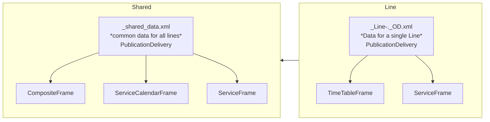
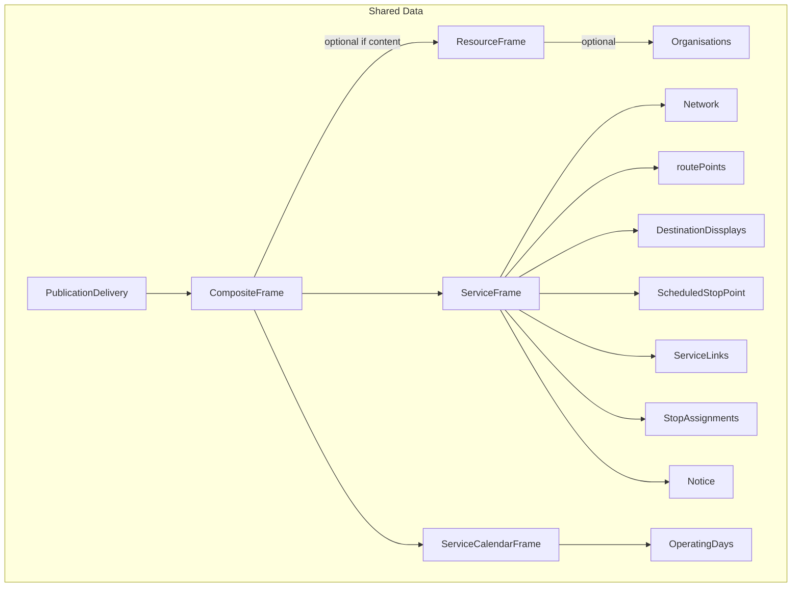
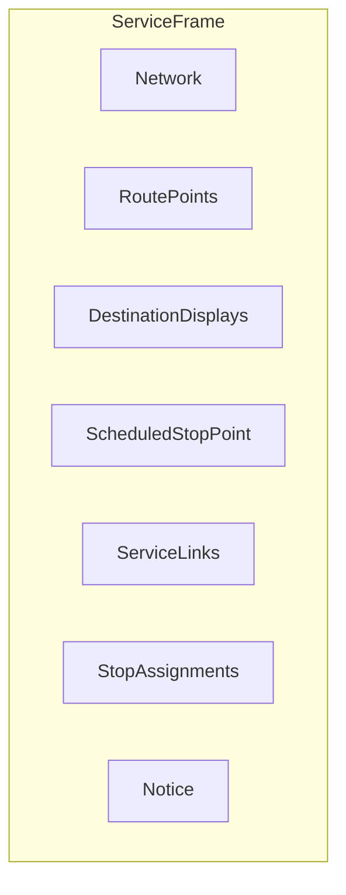
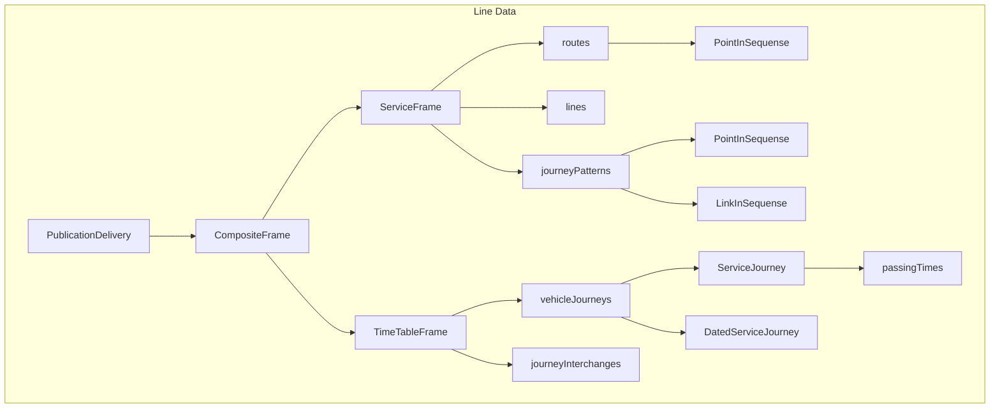

# Guide: Exchanging Timetable data
>[!NOTE]
>This guide provides a practical description of the data needed to describe a passenger timetable and how to structure the data for exchange as xml files according to NeTEx European Recomended Profile. The required data includes the network topology, the possible journey patterns along the stops in the network, the actual journeys and timing, and the calendar that describe on which days the journeys are run.

## Table of Contents
- [Guide: Exchanging Timetable data](#guide-exchanging-timetable-data)
  - [Table of content](#table-of-content)
  - [PublicationDelivery root element](#publicationdelivery-root-element)
  - [Organise the data into frames](#organise-the-data-into-frames)
  - [Split the data into seperate files](#split-the-data-into-seperate-files)
- [Shared File](#shared-file)
  - [Introduction](#introduction)
  - [Frames in shared file](#frames-in-shared-file)
    - [ResourceFrame](#resourceframe)
      - [Organisations](#organisations)
    - [ServiceFrame](#serviceframe)
      - [Network](#network)
      - [RoutePoints](#routepoints)
      - [DestinationDisplay](#destinationdisplay)
      - [ScheduledStopPoint](#scheduledstoppoint)
      - [ServiceLinks](#servicelinks)
      - [StopAssignments](#stopassignments)
      - [Notice](#notice)
    - [ServiceCalendarFrame](#servicecalendarframe)
- [Line File](#line-file)
  - [Introduction](#introduction)
  - [Frames in Line File](#frames-in-line-file)
  - [ServiceFrame](#serviceframe)
    - [Route](#route)
    - [Line](#line)
    - [JourneyPattern](#journeypattern)
      - [StopPointInJourneyPattern](#stoppointinjourneypattern)
      - [ServiceLinkINJourneyPattern](#servicelinkinjourneypattern)
  - [TimetableFrame](#timetableframe)
    - [ServiceJourney](#servicejourney)
      - [TimetabledPassingTime](#timetabledpassingtime)
    - [DatedServiceJourney](#datedservicejourney)
## PublicationDelivery root element
As with any NeTEx dataset, the timetable data must be structured into PublicationDelivery xml elements with frames that contain the timetable data.

```xml
<?xml version="1.0" encoding="UTF-8"?>
<PublicationDelivery xmlns="http://www.netex.org.uk/netex">
    <PublicationTimestamp>2025-12-03T09:24:59.781</PublicationTimestamp>
    <ParticipantRef>RB</ParticipantRef>
    <Description>Description of the content of this delivery</Description>
    <dataObjects>
        <CompositeFrame created="2025-12-03T09:24:59.781" version="1" id="VYG:CompositeFrame:18310411">
            <!-- Payload -->
        </CompositeFrame>
    </dataObjects>
</PublicationDelivery>
```
*Figure 1 PublicationDelivery example. The actual timetable data is indicated the example but omitted for brevity*

The PublicationDelivery element is the root element of the xml document. It contains required information about the publication in addition to the ‘payload’ elements, i.e. the timetable data structured as different types of frame elements. For an in depth description of PublicationDelivery, see [PublicationDelivery](/01-Frames/PublicationDelivery.md)

>[!NOTE]
>The ***CompositeFrame*** is an optional wrapper frame that contains other frames. The frames in a CompositeFrame must have the same validity conditions. The validity period stated on the outermost CompositeFrame is considered the dominant validity of all data in the dataset. For more information, see [PublicationDelivery](/01-Frames/PublicationDelivery.md)

## Organise the data into frames
A timetable dataset consists of one or more files containing data structured into frames, some are always required, some are required under certain circumstances, and some are optional
The Frames may be grouped into a ***CompositeFrame*** to share common validaton conditions

The CompositeFrame is an optional wrapper frame that contains other frames. The frames in a CompositeFrame must have the same validity conditions. The validity period stated on the outermost CompositeFrame is considered the dominant validity of all data in the dataset.  

The JourneyPatterns for each line in the network should be placed in a separate ServiceFrame, and the ServiceJourneys making up the schedule for each line in a separate TimetableFrame. Each line in the network thus is described with such a pair of one ServiceFrame and one TimetableFrame. See How to describe each line for further details on the contents of these frames.

The other frames contain common data that can be referenced by all lines in a timetable publication.

Calendar data is placed in a ServiceCalendarFrame. The calendar contains OperatingDays or DayTypes that describe when the services run. The calendar days can be used by more than one line, and the schedules for the different lines in the network will typically refer to the same calendar days.

Common resources are placed in a ResourceFrame. For timetable data this must include the participating Organisations and Authorities.

The timetable relies on the stop data, which must be available in a SiteFrame. When the stops are available from a national register, there is usually a separate publication containing the stop data. TBD how to tie timetables to stops

## Split the data into seperate files

To reduce the size of the files it is recommended to split the timetable datasets into several files. The preferred way to do so in this guide is:
Create one file with frames containing common data for all lines in the network. The file name must start with _ (underscore) and should include the codespace of the data provider, e.g. _[codespace]_shared_data.xml
Create one file per line in the network with one TimetableFrame and one ServiceFrame containing the schedule and patterns for the line. The file name must follow the convention of including the codespace of the data provider, the line number and the line name, e.g. RUT_RUT-Line-4_4_Vestli---Bergkrystallen.xml




*Figure 2: Example of a Timetable dataset with several PublicationDeliveries in separate files*


# Shared File
## Introduction
The shared file contain information shared between all lines so it is not necessary to recreate this in each line file
## Frames in shared file



<details>
<summary>
  <b>Extend to see an simplified example</b>
</summary>

```xml
<?xml version="1.0" encoding="UTF-8"?>
<PublicationDelivery xmlns="http://www.netex.org.uk/netex">
    <PublicationTimestamp>2025-12-03T09:24:59.781</PublicationTimestamp>
    <ParticipantRef>RB</ParticipantRef>
    <Description>Description of the content of this delivery</Description>
    <dataObjects>
        <CompositeFrame created="2025-12-03T09:24:59.781" version="1" id="VYG:CompositeFrame:18310411">
            <validityConditions>
                <AvailabilityCondition version="1" id="VYG:AvailabilityCondition:18310407>
                    <FromDate>2025-11-30T00:00:00</FromDate>
                    <ToDate>2026-12-02T00:00:00</ToDate>
                </AvailabilityCondition>
            </validityConditions>
            <codespaces></codespaces>
            <FrameDefaults></FrameDefaults>
            <frames>
                <ResourceFrame>
                    <organisations></organisations>
                </ResourceFrame>
                <ServiceFrame>
                    <Network></Network>
                    <additionalNetworks>
                        <Network></Network>
                    </additionalNetworks>
                    <routePoints>
                        <RoutePoint></RoutePoint>
                    </routePoints>
                    <destinationDisplays>
                        <DestinationDisplay></DestinationDisplay>
                    </destinationDisplays>
                    <scheduledStopPoints>
                        <ScheduledStopPoint></ScheduledStopPoint>
                    </scheduledStopPoints>
                    <serviceLinks>
                        <ServiceLink>
                            <FromPointRef ref=""></FromPointRef>
                            <ToPointRef ref=""></ToPointRef>
                        </ServiceLink>
                    </serviceLinks>
                    <stopAssignments></stopAssignments>
                    <notices>
                        <Notice></Notice>
                    </notices>
                </ServiceFrame>
                <ServiceCalendarFrame>
                    <operatingDays>
                        <OperatingDay>
                            <CalendarDate></CalendarDate>
                        </OperatingDay>
                    </operatingDays>
                </ServiceCalendarFrame>
            </frames>
        </CompositeFrame>
    </dataObjects>
</PublicationDelivery>
```
*Frames in shared file, shows only frames, content is described later*
</details>

### ResourceFrame
The ResourceFrame contains the organisations used in this delivery
>[NOTE]
>Organisations in shared ResourceFrame is optional, if there is a national Organisation registry, the delivery should use ref to the organisation registry!
#### Organisations
Organisations is those organisations who is responsible for the offer and those who operates the lines
- Authority: The authority of the line(s)
- Operator: The operator operating line(s)
##### Fields
The fields used for the publication of timetable data
More information about organisations for public transport is found here: [Authority](/10-Objects/Authority.md) and [Operator](/10-Objects/Operator.md)

| Field | Type | Mandatory | Description  |
| -- | -- | -- | -- |
| id | attribute | **YES** | The ID of the organisation |
| version | attribute | **YES** | the version of this record, if data is changed, the version should increase |
| Name                 | ??| **YES** | The name of the organisations |
| ContactDetails | ContactDetails | NO | Contact Details for the organisation  |
| Phone | ?? | no | Phone number |
| Url | ?? | no | The url to the organisations web site for more information |
| OrganisationType | OrganisationType | **YES**| Type of organisation, authority or operator |
<details>
<summary>
  <b>Extend to see an example</b>
</summary>

```xml
<organisations>
    <Authority version="1" id="VYG:Authority:VY">
        <Name>Vy</Name>
        <ContactDetails>
            <Phone>+47 61 05 19 10</Phone>
            <Url>https://www.vy.no/</Url>
        </ContactDetails>
        <OrganisationType>authority</OrganisationType>
    </Authority>
    <Operator version="1" id="VYG:Operator:VY">
        <Name>VY</Name>
        <OrganisationType>operator</OrganisationType>
        <CustomerServiceContactDetails>
            <Email>support@vy.no</Email>
            <Phone>+47 61 05 19 10</Phone>
            <Url>https://www.vy.no/</Url>
        </CustomerServiceContactDetails>
    </Operator>
</organisations>
```
</details>

### ServiceFrame
>[TODO]
>Short description and link to EPIP documentation


#### Network
>[TODO]
>Short description and link to EPIP documentation

| Field | Type | Mandatory | Description  |
| -- | -- | -- | -- |
| id | attribute |  **YES** | The ID of this network |
| version | attribute | **YES** | The version of this record, should be updated if the record is changed |
| Name | ?? | **YES** | The name of hte network |
| AuthorityRef | ?? | **YES** | The authority which is the owner of this network |<details>
<summary>
  <b>Extend to see an example</b>
</summary>

```xml
<Network version="0" id="VYG:Network:TAG">
    <Name>TAG</Name>
    <AuthorityRef ref="VYG:Authority:TAG" version="0"></AuthorityRef>
</Network>
<additionalNetworks>
    <Network version="0" id="VYG:Network:VY">
        <Name>VY</Name>
        <AuthorityRef ref="VYG:Authority:VY" version="1"></AuthorityRef>
    </Network>
</additionalNetworks>
```

</details>

#### RoutePoints
>[TODO]
>Short description and link to EPIP documentation

| Field | Type | Mandatory | Description  |
| -- | -- | -- | -- |
| id | attribute |  **YES** | The ID of this RoutePoint |
| version | attribute | **YES** | The version of this record, should be updated if the record is changed |
| Name | ?? | **YES** | The name of this RoutePoint |
| PointPRojection | ?? | **YES** | ??? |
| ProjectedPointRef | ?? | **YES** | Reference to a ScheduledStopPoint **(TODO) or other?** |
<details>
<summary>
   Extend to see an example
</summary>

```xml
<routePoints>
    <RoutePoint version="1" id="VYG:RoutePoint:NTH">
        <Name>Nationaltheatret</Name>
        <projections>
        <PointProjection version="1" id="VYG:PointProjection:18278550">
            <ProjectedPointRef ref="VYG:ScheduledStopPoint:NTH-4" version="1"></ProjectedPointRef>
        </PointProjection>
        </projections>
    </RoutePoint>
</routePoints>
```
</details>

#### DestinationDisplay
>[TODO]
>Short description and link to EPIP documentation

| Field | Type | Mandatory | Description  |
| -- | -- | -- | -- |
| id | attribute |  **YES** | The ID of the DestinationDisplay |
| version | attribute | **YES** | The version of this record, should be updated if the record is changed |
| FrontText | ?? | **YES** | The text shown in front of the vehicle |
| SideText | ?? | NO | ?? |
<details>
<summary>
  Extend to see an example
</summary>

```xml
<DestinationDisplay version="1" id="VYG:DestinationDisplay:R45-55_FlaAm">
    <FrontText>Flåm</FrontText>
</DestinationDisplay>
```

</details>

#### ScheduledStopPoint
>[TODO]
>Short description and link to EPIP documentation

| Field | Type | Mandatory | Description  |
| -- | -- | -- | -- |
| id | attribute |  **YES** | The ID of the ScheduledStopPoint |
| version | attribute | **YES** | The version of this record, should be updated if the record is changed |
| Name | ?? | **YES** | The name of the ScheduledStopPoint|<details>
<summary>
  Extend to see an example
</summary>

```xml
<ScheduledStopPoint version="1" id="VYG:ScheduledStopPoint:HEI-1">
    <Name>Heia</Name>
</ScheduledStopPoint>
```

</details>

#### ServiceLinks
>[TODO]
>Short description and link to EPIP documentation

| Field | Type | Mandatory | Description  |
| -- | -- | -- | -- |
| Distance | ?? | **YES**? | The distance between the From and To Point |
| projections | list| **YES** ? | List of LinkSequenceProjection |
|LinkSequenceProjection - id| attribute | **YES** | The id of the LinkSequenceProjection |
|LinkSequenceProjection - version| attribute | **YES** | The version of the LinkSequenceProjection |
| gis:LineString srsName | attribute |  **YES** | Name of the LineString |
| gis:LineString srsDimension | attribute |  **YES** | ?? |
| gis:id srsDimension | attribute |  **YES** | ?? |
| gis:posList count | attribute |  **YES** | ?? |
| gis:posList srsDimension | attribute |  **YES** | ?? |
|content of gis:posLIst| ?? | **YES** | Points needed to drav the Line ??|
| FromPointRef | ?? | **YES** | ?? |
| ToPointRef | ?? | **YES** | ?? |

<details>
<summary>
  Extend to see an example
</summary>


```xml
<serviceLinks>
    <ServiceLink>
        <Distance>7699.853253</Distance>
        <projections>
            <LinkSequenceProjection version="1" id="VYG:LinkSequenceProjection:18285403">
            <gis:LineString srsName="4326" srsDimension="2" gis:id="LS_1700918">
                <gis:posList count="788" srsDimension="2">
                    <!-- all GIS points, like 60.30479 10.58477 60.30503 10.58475 etc -->
                </gis:posList>
            </gis:LineString>
            </LinkSequenceProjection>
        </projections>
        <FromPointRef ref="VYG:ScheduledStopPoint:LU-1" version="1"></FromPointRef>
        <ToPointRef ref="VYG:ScheduledStopPoint:GRA-1" version="1"></ToPointRef>
    </ServiceLink>
</serviceLinks>
```

</details>

#### StopAssignments
>[TODO]
>Short description and link to EPIP documentation

 stopAssignments is a list of all PassengerStopAssignment

| Field | Type | Mandatory | Description  |
| -- | -- | -- | -- |
| id | attribute |  **YES** | The ID of the PassengerStopAssignment |
| version | attribute | **YES** | The version of this record, should be updated if the record is changed |
| ScheduledStopPointRef | ?? | **YES** | The reference to a ScheduledStopPoint |
| QuayRef | ?? | **YES** | The reference to a Quay (plattform on a StopPlace) |
<details>
<summary>
  Extend to see an example
</summary>

```xml
<stopAssignments>
    <PassengerStopAssignment order="380" version="1" id="VYG:PassengerStopAssignment:HAL-1">
        <ScheduledStopPointRef ref="VYG:ScheduledStopPoint:HAL-1" version="1"></ScheduledStopPointRef>
        <QuayRef ref="NSR:Quay:111"></QuayRef>
    </PassengerStopAssignment>
</stopAssignments>
```

</details>

#### Notice
>[TODO]
>Short description and link to EPIP documentation

<details>
<summary><b>Click to expand XML example</b></summary>
```xml
<notices>
    <Notice version="1" id="VYG:Notice:332">
        <Text>Toget har ikke kafé, lekerom eller sykkelplasser. Husk å ta med mat og drikke. De fleste setene har ikke bord. / This train does not have a café, playroom, or space for bicycles. Please bring food and drink. Most seats do not have tables</Text>
    </Notice>
</notices>
```
</details>

### ServiceCalendarFrame
>[TODO]
>Short description and link to EPIP documentation
For this Guide, we using DatedServiceJorney, then the ServiceCalenderFrame contains a list of OperatinDays:

| Field | Type | Mandatory | Description  |
| -- | -- | -- | -- |
| id | attribute |  **YES** | The ID of this OperatingDay |
| version | attribute | **YES** | The version of this record, should be updated if the record is changed |
|CalendarDate| ISO8601 Day string| **YES** | One specific calendar day |
<details>
<summary>
  Extend to see an example
</summary>
```xml
<operatingDays>
    <OperatingDay version="1" id="VYG:OperatingDay:2026-01-30">
        <CalendarDate>2026-01-30</CalendarDate>
    </OperatingDay>
</operatingDays>
```

</details>

# Line File
## Introduction
>[TODO]
>Short description and link to EPIP documentation
>Also about this way of exchange timetable data, why using DatedServiceJourney
## Frames in Line File



<details>
<summary>
  <b>Extend to see an simplified example</b>
</summary>

```xml
<?xml version="1.0" encoding="UTF-8"?>
<PublicationDelivery xmlns="http://www.netex.org.uk/netex">
    <PublicationTimestamp>2025-12-03T09:24:59.781</PublicationTimestamp>
    <ParticipantRef>RB</ParticipantRef>
    <Description>Description of the content of this delivery</Description>
    <dataObjects>
        <CompositeFrame created="2025-12-03T09:24:59.781" version="1" id="VYG:CompositeFrame:18310411">
            <validityConditions>
                <AvailabilityCondition version="1" id="VYG:AvailabilityCondition:18310407">
                    <FromDate>2025-11-30T00:00:00</FromDate>
                    <ToDate>2026-12-02T00:00:00</ToDate>
                </AvailabilityCondition>
            </validityConditions>
            <codespaces>
                <Codespace id="vyg">
                    <Xmlns>VYG</Xmlns>
                    <XmlnsUrl>http://www.rutebanken.org/ns/vyg</XmlnsUrl>
                </Codespace>
            </codespaces>
            <FrameDefaults></FrameDefaults>
            <frames>
                <ServiceFrame version="1" id="VYG:ServiceFrame:18309357">
                   <routes>
                       <Route version="0" id="VYG:Route:R14-F">
                           <Name>ASR - KVG</Name>
                           <ShortName>ASR-KVG</ShortName>
                           <LineRef ref="VYG:Line:R14" version="0"></LineRef>
                           <pointsInSequence>
                               <PointOnRoute version="1" id="VYG:PointOnRoute:18308245">
                                   <RoutePointRef ref="VYG:RoutePoint:ASR"></RoutePointRef>
                               </PointOnRoute>
                               <!-- Rest of PointOnRoute -->
                           </pointsInSequence>
                           <InverseRouteRef ref="VYG:Route:R14-R" version="0"></InverseRouteRef>
                       </Route>
                   </routes>
                    <lines>
                        <Line version="0" id="VYG:Line:R14">
                            <Name>Asker-Oslo S-Kongsvinger</Name>
                            <TransportMode>rail</TransportMode>
                            <PublicCode>R14</PublicCode>
                            <PrivateCode>R14</PrivateCode>
                            <OperatorRef ref="VYG:Operator:VY"></OperatorRef>
                            <RepresentedByGroupRef ref="VYG:Network:VY"></RepresentedByGroupRef>
                            <Presentation>
                                <Colour>DF2027</Colour>
                                <TextColour>FFFFFF</TextColour>
                            </Presentation>
                        </Line>
                    </lines>
                    <journeyPatterns>
                        <JourneyPattern version="0" id="VYG:JourneyPattern:R14-900">
                            <Name>ASR-KVG</Name>
                            <RouteRef ref="VYG:Route:R14-F" version="0"></RouteRef>
                            <pointsInSequence>
                                <StopPointInJourneyPattern order="1" version="0" id="VYG:StopPointInJourneyPattern:R14-900-1">
                                    <ScheduledStopPointRef ref="VYG:ScheduledStopPoint:ASR-2"></ScheduledStopPointRef>
                                    <ForAlighting>false</ForAlighting>
                                    <DestinationDisplayRef ref="VYG:DestinationDisplay:R14-38_Kongsvinger"></DestinationDisplayRef>
                                </StopPointInJourneyPattern>
                                <!-- Rest of StopPointInJourneyPattern -->
                            </pointsInSequence>
                            <linksInSequence>
                                <ServiceLinkInJourneyPattern order="1" version="1" id="VYG:ServiceLinkInJourneyPattern:18308285">
                                    <ServiceLinkRef ref="VYG:ServiceLink:ASR-2_SV-4_-1313061262"></ServiceLinkRef>
                                </ServiceLinkInJourneyPattern>
                                <!-- Rest of ServiceLinkInJourneyPattern -->
                            </linksInSequence>
                        </JourneyPattern>
                    </journeyPatterns>
                </ServiceFrame>
                <TimetableFrame  version="1" id="VYG:TimetableFrame:18309358">
                    <vehicleJourneys>
                        <ServiceJourney>
                            <passingTimes>
                                <TimetabledPassingTime>
                                    <PointInJourneyPatternRef ref=""></PointInJourneyPatternRef>
                                </TimetabledPassingTime>
                            </passingTimes>
                        </ServiceJourney>
                        <DatedServiceJourney></DatedServiceJourney>
                    </vehicleJourneys>
                </TimetableFrame>
            </frames>
        </CompositeFrame>
    </dataObjects>
</PublicationDelivery>
```
</details>

## ServiceFrame
### Route
### Line
### JourneyPattern
#### StopPointInJourneyPattern
#### ServiceLinkINJourneyPattern

## TimetableFrame
### ServiceJourney
#### TimetabledPassingTime
### DatedServiceJourney